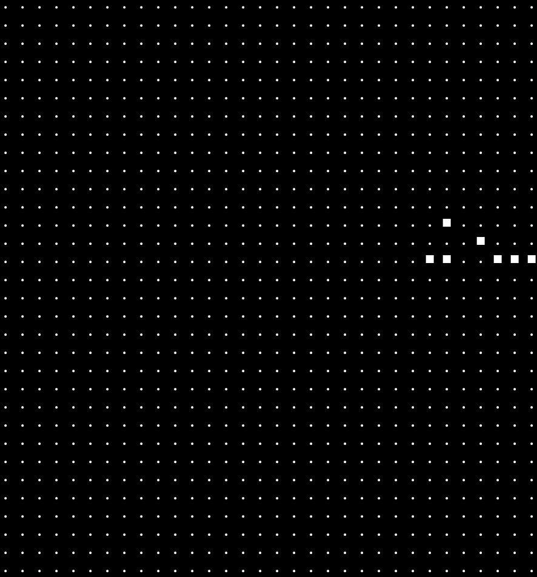
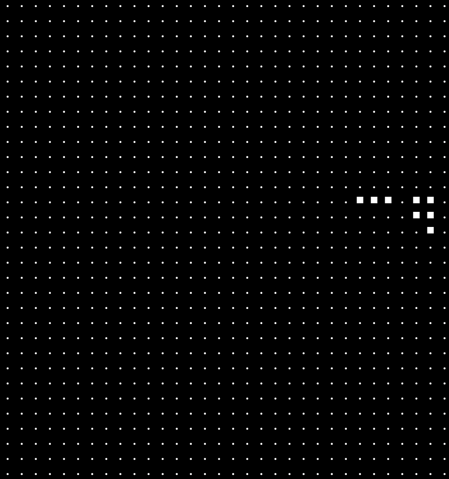

# GoL2

Game of L2

Cellular automata on replicated state machine.
An implementation of Conway's Game of Life as a contract on StarkNet, written
in Cairo, with an interactive element.

Players can alter the state of the game, affecting the future of the simulation.
People may create interesting states or coordinate with others to achieve some
outcome of interest.

This implementation is novel in that the game state shared (agreed by all) and permissionless
(anyone may participate). The game rules are enforced by a validity proof, which means that
no one can evolve the game using different rules.

The main rules of the game are:

- The normal rules of Conways' Game of Life (3 to revive, 2 or 3 to stay alive).
- The boundaries wrap - a glider may travel infinitely within the confines of the grid.

|Acorn generation 0|Acorn generation 1|
|:--: | :--:|
| |  |

## Game modes

There are two modes: Inifinite and Creator

- Usage and Mechanics
    - [Infinite](descriptions/usage_infinite.md)
    - [Creator](descriptions/usage_creator.md)
- Frontend Considerations
    - [General notes](descriptions/frontend_spec_general_notes.md)
    - [Infinite](descriptions/frontend_spec_infinite.md)
    - [Creator](descriptions/frontend_spec_creator.md)
- Example deployments
    - [Infinite](https://voyager.online/contract/0x06dd56f17fba09c62d9a1f3542f184de7b157eb178b13661d7d9ed44f977d1db#readContract)
    - [Creator](https://voyager.online/contract/0x01fff3f1807f873ddeaa61bbea8910bd8d1e04399d9fa5db29b80c25aa1121db#readContract)
    - Note that calling these functions in the explorer will originate
transactions from the zero-address. Calling from the Account directly will follow
as wallet/SDK infrastructure is connected.


### Infinite

A single game with an ability for participants to evolve the game to its next state.
By doing so they also gain a special power - to revive a single cell at their discretion.

The game may flourish and produce a myriad of diverse game states, or it may fall to ruin and
become a barren wasteland. It will be up to the participants to decide if and when to use
their life-giving power.

The purpose of this game mode is to encourage collaboration.

### Creator

An open-ended collection of starting states that anyone can create. A player
can specify the alive/dead state for all the cells in the game they spawn. The
game can be evolved from that point, but individual cells cannot be altered.

Anyone can progress a game, and in return they get creator credits. Ten creator
credits can be redeemed to spawn their own game.

The purpose of this game is to allow players to explore interesting starting
patterns in the the game. E.g., inventing new starting positions that last a
many generations before dying out or create a unique pattern.

# Architecture

Each game mode is a separate contract and holds the state of Conway's Game of Life.

- The game board is a square with side length `dim`, (E.g., dim = 16) containing `dim**2` cells.
Cells wrap around edges.
- Every cell is in storage as alive or dead.
    - A row of cells will be stored as a binary number of length `dim` (max `dim` is
    limited to 250 bit due to field size).
    - Each row is stored as a felt in storage. (`dim` storage updates per interaction)
- When the contract is called by a player to progress a game it:
    1. Runs the simulation for one generation..
    2. Saves the new state to storage.
    3. Saves the generation.
    4. Issues a credit.
- Anyone can call the contract to view the game which returns a set of 32 integers
representing rows of the game board. The columns are binary encoded with 0 or 1 for
dead/alive states in each row.
- Anyone with a `Warden` token may call `give_life_to_cell` once per token to
revive a chosen cell.

## Inner Contract Operations

- A player calls the external function to have a turn.
- Initialization: A `cell_states` array is created to hold the state of all the cells
(length `dim**2`):
    1. Iterate over `dim` to access rows by index indices)
    2. Call `saved_cells.read(row)` to get binary representation of state (for each row).
    3. For each bit, save it as a felt to the array.
        - Use a mask for each column: `state[dim*row + column] = bitwise_and(row, 2**column)`)
        - At the end of the contract call the state will be converted back to binary
        representation for storage.
- Simulation: A `next_state` array is made to hold the values during evaluation.
    1. Iterate over all cells (``dim**2``).
    2. For each cell check and sum all 8 neighbours, apply life rule and save alive/dead (`0/1`).
    3. Save result to `next_state` array.
    4. After final cell is read, change the array to point at the new neighbour array
    `cell_states=next_state`.
- Repeat simulation for `number_of_generations`.
- Recreate the binary representation of each row and save with `saved_cells.write(row)`.

In `Infinite` mode, a give life action is processed as follows:

- A player calls `give_life(row_index, col_index)`.
- The current row is read from storage.
- The column is applied with a bitwise AND mask to the row.
- The row is saved to storage.
- The player loses one give life credit.

In `Creator` mode, a player submits an array of 32 integers, representing the rows
of the game. The game then stores these, ensuring that no two starting points are the same.
Anyone can then evolve that game to earn a creator credit.

## Token contract ownership model

The games currently have tokens as an internal representation. There is no ERC20/ERC721
connected to the game at the moment. Given that each game state is stored
on chain, another contract could be written to interact with this
game (e.g. to score games by some metric).

## Example storage

Storage: store `DIM` rows as binary alive/dead
```
row[0] = 01001100101001010100110010100101   (as a felt: 1285901477).
row[1]
...
row[dim] = 10001100010101001001010100110010   (as a felt: 2354353458).
```
Calling `view_game()` will produce `dim` numbers in decimal representation, which
can be rendered as binary (e.g., in the console).

## Parameters

```
dim = 32 (max 250)
cell_count = dim**2 (e.g., 1024 cells if DIM=32)
```

## Dev

Activate virtual environment with python >=3.7. Install
cairo-lang either with nile or directly.

Nile:

    pip install cairo-nile
    https://github.com/OpenZeppelin/nile

Directly:

    pip install cairo-lang

### Data structure

Both game modes use a binary encoded game state. Calling for a
game state will return 32 numbers, the starting state for the Infinite
game is the Acorn (as shown in the image above),
situated mid-right.

```
0 0 0 0 0 0 0 0 0 0 0 0 32 8 103 0 0 0 0 0 0 0 0 0 0 0 0 0 0 0 0 0

Which decoded as bin(32), bin(8) and bin(103) take the acorn form:

   100000
     1000
  1100111
```
After evolving one generation, and calling for the state again, the
returned state is:

```
0 0 0 0 0 0 0 0 0 0 0 0 0 118 6 2 0 0 0 0 0 0 0 0 0 0 0 0 0 0 0 0

Or:
  1110110
      110
       10
```

If for example a user gave life to a particular cell
(row index `9` and column index `9`). The state would then be:

```
0 0 0 0 0 0 0 0 0 4194304 0 0 0 118 6 2 0 0 0 0 0 0 0 0 0 0 0 0 0 0 0 0

Where 4194304 is the binary number: 00000000010000000000000000000000

Column index 9 is '1', or 'alive' now.
```
This single cell would die out in the next generation, and so would not be a
wise placement, unless other cells are placed in adjacent locations.
